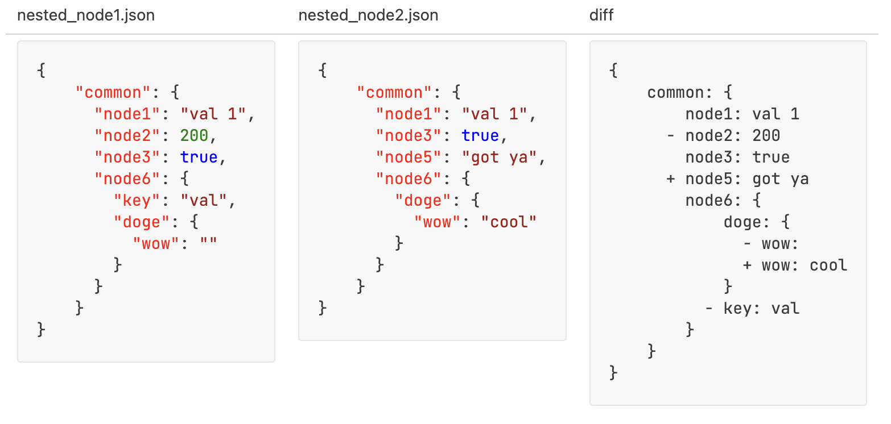

[](https://github.com/mbelveder/python-project-50/actions) [](https://codeclimate.com/github/mbelveder/python-project-50/maintainability) [](https://codeclimate.com/github/mbelveder/python-project-50/test_coverage)

### Description

A Python package to generate a diff between two nested structures.

```
gendiff nested_node1.json nested_node2.json
```


Example input files are located at [tests/fixtures](tests/fixtures).

Supports custom replacers and indent increments for the `stylish` (default) output:

```
gendiff nested_node1.json nested_node2.json --replacer  ⏐ --increment 2
```

```
{
⏐⏐common: {
⏐⏐⏐⏐node1: val 1
⏐⏐- node2: 200
⏐⏐⏐⏐node3: true
⏐⏐+ node5: got ya
⏐⏐⏐⏐node6: {
⏐⏐⏐⏐⏐⏐doge: {
⏐⏐⏐⏐⏐⏐- wow: 
⏐⏐⏐⏐⏐⏐+ wow: cool
⏐⏐⏐⏐⏐⏐}
⏐⏐⏐⏐- key: val
⏐⏐⏐⏐}
⏐⏐}
}
```

And the `plain` output format:

```
gendiff --format plain nested_node1.json nested_node2.json
```

```
Property 'common.node2' was removed
Property 'common.node5' was added with value: 'got ya'
Property 'common.node6.doge.wow' was updated. From '' to 'cool'
Property 'common.node6.key' was removed
```

<!-- <details>
<summary>Example (open on a wide screen)</summary>
<table>
<tr>
<td > nested_node1.json </td>
<td > nested_node2.json </td>
<td > diff </td>
</tr>
<tr>
<td style="vertical-align:top">

```json
{
    "common": {
      "node1": "val 1",
      "node2": 200,
      "node3": true,
      "node6": {
        "key": "val",
        "doge": {
          "wow": ""
        }
      }
    }
}
```

</td>
<td style="vertical-align:top">
    
```json
{
    "common": {
      "node1": "val 1",
      "node3": true,
      "node5": "got ya",
      "node6": {
        "doge": {
          "wow": "cool"
        }
      }
    }
}
```

</td>
</td>
<td style="vertical-align:top">
    
```text
{
    common: {
        node1: val 1
      - node2: 200
        node3: true
      + node5: got ya
        node6: {
            doge: {
              - wow: 
              + wow: cool
            }
          - key: val
        }
    }
}
```
</td>
</tr>
</table>

</details> -->

The package works both with JSON and YAML files. The `json` output format shows what happened to each node (`added`, `deleted`, `changed` or `unchanged`):

[](https://asciinema.org/a/HuOgkKzA76RJu0G6MsUYq7OMM)


Created during the [Hexlet](https://ru.hexlet.io/programs/python) "Python developer" course without any mentoring.


### Installation

#### Requirements

- Python 3.11 or higher
- Git

```
pip3 install git+https://github.com/mbelveder/gendiff.git
```
***

### Topics covered:

- Test-driven development

- Recursive tree traversal

- Separation of abstraction layers (the [diff itself](https://github.com/mbelveder/gendiff/blob/e2e005ddab480fcbc5a80a70fa71f466e8c0e808/gendiff/generate_diff.py#L16) is separate from its [representations](gendiff/format))

- Continuous integration via [GitHub Actions](https://github.com/features/actions)

- Dependency management via [Poetry](https://python-poetry.org/)